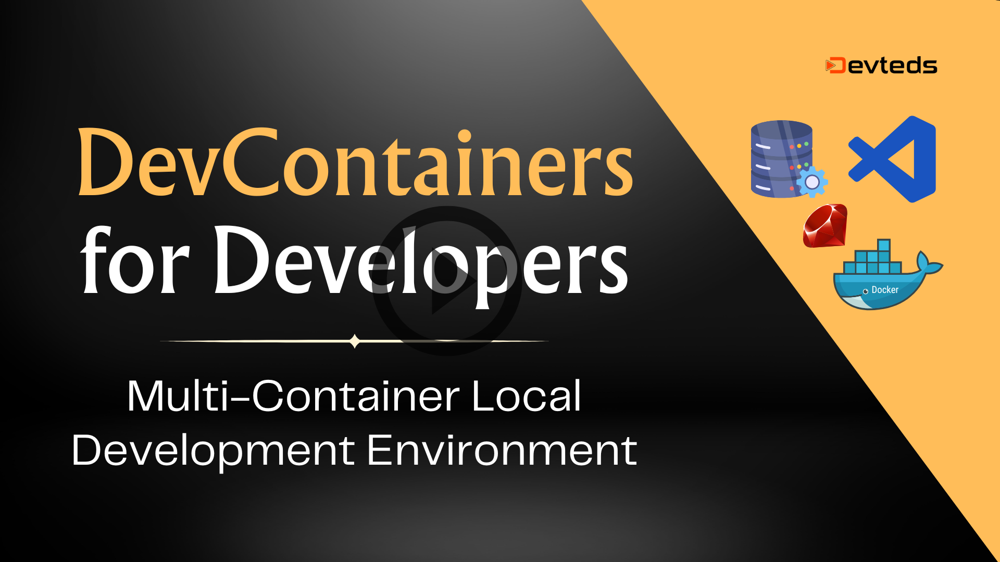

# DevContainers for Developers

### Multi-Container Local Development Setup using `DevContainers` in Visual Studio Code (VSCode)

This source code is for the [short course](https://youtu.be/xfeQ6vDuidA)

## Announcement: Course on Kubernetes

> If you want to start deploying your containers to Kubernetes, especially on AWS EKS, [check this course on Kubernetes](https://www.devteds.com/kubernetes-course-aws-eks-terraform) that walkthrough creating Kubernetes cluster on AWS EKS using Terraform and deploying multiple related containers applications to Kubernetes and more. https://www.devteds.com/kubernetes-course-aws-eks-terraform 

---

[Course video link](https://youtu.be/xfeQ6vDuidA)

[](https://youtu.be/xfeQ6vDuidA)

Visit https://devteds.com to watch all the videos and courses on DevOps and Cloud courses.

## Terminal Window Log

### Code

```
mkdir ~/projs
git clone https://github.com/devteds/devcontainers-for-developers-rails-multi-container-local-setup.git devcontainers-for-dev
cd devcontainers-for-dev
```

### Update DevContainer Config

Review and make necessary,

- app or db containers, under `.devcontainer/`
- docker-compose.yml

## Tools & Versions I used

- MacOS, Apple M1 chip
- Docker 24.0.2, build cb74dfc
- Docker Compose version v2.18.1
- VSCode 1.87.2 (Universal)
